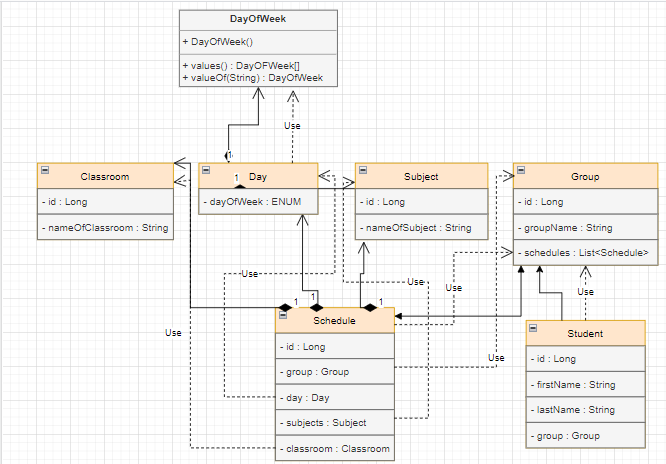

#University - project
It is a simple university project.
That give you opportunity to find out which subjects do you have in specified day

***

### Features of this app :
- Cinema app implements 3 layers architecture with DAO, Service, Controller layers.
- Using REST architectural style.
- At this app we have CRUD methods for all entity.

***

### Technologies which were used in app :
- Spring Boot
- Maven
- junit(4.13.2)
- PostgeSQL
- Docker

***

### In this app I've already add 
- 30 students
- 3 groups
- 10 subjects
- 7 days
- 10 classrooms
- and 22 schedules

***
### This how looks our DB


***
### Available endpoints
For Classroom:
- GET  - /classrooms  for get all classrooms.
- GET  - /classrooms/{id}  for get classrooms by id.
- POST - /classrooms  add classroom to DB.
- PUT  - /classrooms/{id}  update classroom in DB.
- DELETE - /classrooms/{id}  delete classroom from DB.

***

For Day:
- GET  - /days  for get all days.
- GET  - /days/{id}  for get day by id.
- POST - /days  add day to DB.
- PUT  - /days/{id}  update day in DB.
- DELETE - /days/{id} delete day from DB.

***

For Group:
- GET  - /groups  for get all groups.
- GET  - /groups/{id}  for get group by id.
- POST - /groups  add group to DB.
- PUT  - /groups/{id}  update group in DB.
- DELETE - /groups/{id} delete group from DB.

***

For Schedule:
- GET  - /schedules  for get all schedules.
- GET  - /schedules/{id}  for get schedule by id.
- GET  - /schedules/by-student for get schedule by student is and day of week
- POST - /schedules  add schedule to DB.
- PUT  - /schedules/{id}  update schedule in DB.
- DELETE - /schedules/{id} delete schedule from DB.

***

For Student:
- GET  - /students  for get all students.
- GET  - /students/{id}  for get student by id.
- POST - /students  add student to DB.
- PUT  - /students/{id}  update student in DB.
- DELETE - /students/{id} delete student from DB.

***

For Subject:
- GET  - /subjects  for get all student.
- GET  - /subjects/{id}  for get student by id.
- POST - /subjects  add student to DB.
- PUT  - /subjects/{id} update student in DB.
- DELETE - /subjects/{id} delete student from DB.

***

### Command for downloading docker:
```docker pull 99128755/university```